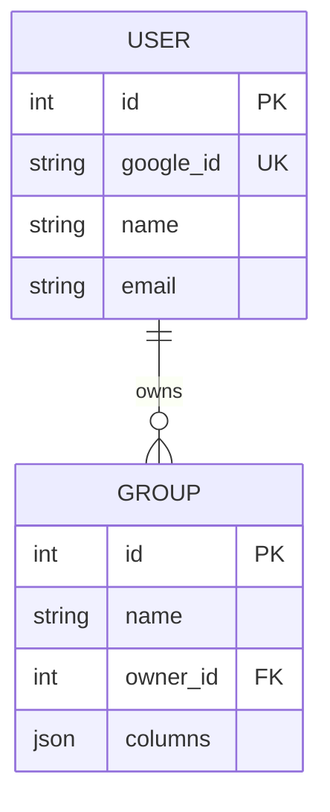
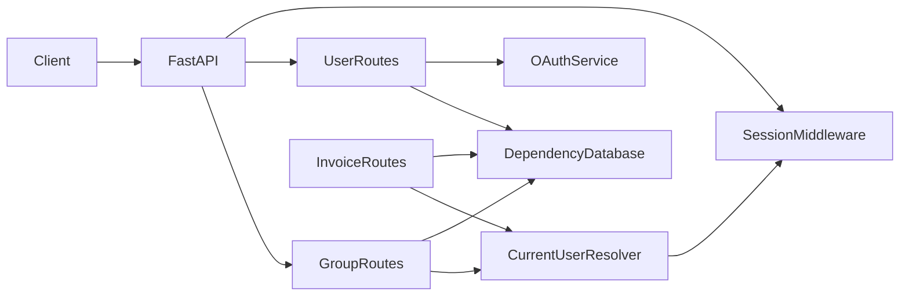

# MoMoney Backend Concept and Software Architecture

## 1. Summary

MoMoney is a web application for organizing expense data from receipts into a spreadsheet-like structure. The product concept combines three ideas:

- receipt or note capture
- AI-assisted extraction or summarization of spending data
- structured storage of the extracted result so users can manage expenses in reusable groups

At the current backend state, the implemented system is a lightweight FastAPI service that supports:

- Google OAuth login
- session-based authentication
- user persistence
- CRUD operations for expense groups

The codebase already includes placeholders for AI and image-processing services, but those parts are not fully integrated into the API yet.

## 2. What This App Does

From the repository description and frontend concept, the intended app flow is:

1. A user logs in with Google.
2. The user creates a group or spreadsheet-like container for expense data.
3. The user defines columns for that group, such as date, merchant, category, amount, and notes.
4. Receipt images are expected to be processed by AI so the app can summarize or extract spending information.
5. The extracted data is then stored and shown in a structured table.

In the current backend implementation, steps 1 to 3 are available. Steps 4 and 5 are only partially prepared through service files and are not exposed as working API features yet.

## 3. Backend Scope Today

The backend folder currently provides these core capabilities:

- application bootstrap and router registration
- relational database access with SQLModel
- Google OAuth integration
- server-side session handling
- user model and persistence
- group model and CRUD endpoints
- automated tests for group operations

The backend does not currently implement invoice storage, receipt upload endpoints, spreadsheet row storage, or a complete Gemini extraction workflow.

## 4. Backend Folder Structure

```text
backend/
  app.py
  database.py
  requirements.txt
  domain/
    users/
      entity.py
      routes.py
      schemas.py
    groups/
      entity.py
      routes.py
      schemas.py
    invoices/
      entity.py
      routes.py
      schemas.py
  services/
    dependencies/
      auth.py
      database.py
    oauth_services.py
    gemini_services.py
    image_services.py
  tests/
    conftest.py
    test_groups.py
    test_invoices.py
```

### Folder responsibilities

- `app.py`: initializes FastAPI, creates database tables on startup, attaches middleware, and registers routers.
- `database.py`: compatibility module that re-exports the canonical database dependency.
- `domain/users`: contains the user entity, user schemas, and login-related endpoints.
- `domain/groups`: contains the group entity, request and response schemas, and CRUD endpoints for groups.
- `domain/invoices`: contains invoice entity, schemas, and CRUD endpoints.
- `services`: contains integrations and helper services such as OAuth, Gemini client setup, and image encoding.
- `services/dependencies`: contains shared dependency functions used by routes (database session and current user resolver).
- `tests`: contains a SQLite-backed test setup and CRUD tests for group endpoints.

## 5. Tech Stack

### Backend framework

- FastAPI for HTTP API development
- Starlette session middleware for cookie-based session handling
- SQLModel for ORM + data models
- Pydantic for validation and serialization

### Authentication

- Authlib for Google OAuth integration
- Google OpenID Connect metadata endpoint for login configuration

### Database

- SQLModel is configured against a relational database URL from `DATABASE_URL`
- The checked-in environment file indicates PostgreSQL is the intended runtime database
- SQLite is used in tests for isolated execution

### AI and utility services

- OpenAI-compatible client configured against the Gemini API endpoint
- simple base64 image encoding helper for future receipt upload or inference payloads

### Frontend context

- Next.js with React is present in the repository
- The frontend suggests a spreadsheet-style expense interface with receipt extraction as the main product idea

## 6. Main Entities

The current backend has two implemented database entities.

### User

Represents an authenticated application user.

Fields:

- `id`: integer primary key
- `google_id`: unique Google account identifier
- `name`: display name
- `email`: validated email address

Responsibilities:

- stores identity from Google OAuth
- owns one or more groups
- acts as the security boundary for group access

### Group

Represents a user-owned expense container or spreadsheet definition.

Fields:

- `id`: integer primary key
- `name`: group name
- `owner_id`: foreign key to `user.id`
- `columns`: JSON array of column names

Responsibilities:

- stores a logical table or sheet definition
- defines the columns the user wants to use for expense organization
- is restricted so only the owning user can read, update, or delete it

## 7. Database Design

### High-level model

The database design is currently small and centered on ownership.



### Relationship design

- One user can own many groups.
- Each group belongs to exactly one user.
- Access control is enforced at the application layer by comparing `group.owner_id` to the authenticated user ID.

### Storage approach

The `columns` field is stored as JSON instead of a normalized child table. This keeps the current implementation simple, but it also means:

- column definitions are flexible and easy to store
- column metadata is limited to a string list today
- querying individual columns at the database level is harder
- future spreadsheet features may require normalization into separate tables such as `group_columns`, `rows`, and `cells`

### Current schema implications

This design works for a prototype where groups are mainly user-defined containers. It is not yet a full spreadsheet schema because there are no persisted row, invoice, receipt, or extracted line-item entities.

## 8. API Design

### User and authentication endpoints

- `POST /test-login`: creates or simulates a test user and stores that user in session
- `GET /login`: starts Google OAuth login
- `GET /auth/callback`: completes Google OAuth, upserts the user, and saves the user in session
- `GET /users/`: returns the logged-in user information when session data is present

### Group endpoints

- `POST /groups/`: create a group for the authenticated user
- `GET /groups/`: list the authenticated user's groups
- `GET /groups/{group_id}`: get one group if owned by the current user
- `PATCH /groups/{group_id}`: update one group if owned by the current user
- `DELETE /groups/{group_id}`: delete one group if owned by the current user

### Invoice endpoints

- `POST /groups/{group_id}/invoices`: create one invoice under a group
- `PATCH /invoices/{invoice_id}`: update one invoice
- `DELETE /invoices/{invoice_id}`: delete one invoice

### API style notes

- route handlers use FastAPI dependency injection for database sessions and current user resolution
- response models are defined with SQLModel-based schemas
- authentication is session-based rather than JWT-based
- authorization is explicit inside the group routes

## 9. Authentication and Security Flow

The backend uses session-based authentication.

### Login flow

1. The client calls the login endpoint.
2. The backend redirects the user to Google.
3. Google returns the user to the callback endpoint.
4. The backend reads user info from the OAuth token.
5. The user is created or updated in the database.
6. The backend stores the user object in the server-side session.
7. Protected endpoints read the session and resolve the current user.

### Authorization model

Authorization is ownership-based:

- if no session exists, the request is rejected with `401`
- if a group is not owned by the current user, the request is rejected with `403`

### Important implementation note

Sensitive configuration is environment-driven. In practice, OAuth secrets, database credentials, and AI keys should stay out of version control and be rotated if they were ever committed.

## 10. Service Layer Design

### `oauth_services.py`

This module centralizes Google OAuth client registration. It keeps the provider setup separate from route logic.

### `services/dependencies/database.py`

This module is the canonical source for the SQLModel engine and `get_session` dependency.

### `services/dependencies/auth.py`

This module contains the shared `get_current_user` dependency, which resolves a user from session data.

### `gemini_services.py`

This module creates an OpenAI-compatible client pointed at the Gemini API base URL. The presence of this service indicates the intended architecture for AI receipt processing, but the business function is still a stub.

### `image_services.py`

This module contains a utility to base64-encode images. That is typically useful when sending image bytes to an AI model API.

### Architectural interpretation

The service layer is intended to isolate external integrations from route handlers. That is the right direction for future growth, especially once receipt parsing and spreadsheet generation become real features.

## 11. Request and Data Flow

The current backend request flow is straightforward.



Typical group request flow:

1. A request hits a `/groups` endpoint.
2. FastAPI injects a database session.
3. The `get_current_user` dependency reads the session.
4. The backend loads the corresponding user from the database.
5. The route performs CRUD logic on the `Group` table.
6. The result is serialized and returned.

## 12. Testing Strategy

The backend includes automated tests for group operations.

### Current test approach

- uses `pytest`
- uses FastAPI `TestClient`
- overrides the production database dependency
- uses temporary SQLite storage for repeatable tests
- overrides authentication so tests can focus on business behavior

### What is covered

- create group
- list groups
- read a specific group
- update a group
- delete a group
- create invoice
- update invoice
- delete invoice
- read group with invoices

### What is not covered yet

- OAuth login flow
- session edge cases
- unauthorized and forbidden access scenarios
- Gemini or image service behavior
- startup configuration validation

## 13. Environment and Configuration

The backend depends on several environment variables.

### Required or expected variables

- `DATABASE_URL`: database connection string
- `GOOGLE_CLIENT_ID`: Google OAuth client ID
- `GOOGLE_CLIENT_SECRET`: Google OAuth client secret
- `SESSION_SECRET_KEY`: session middleware secret
- `GEMINI_API_KEY`: Gemini API access key for future AI functionality

### Startup behavior

- the app creates all SQLModel tables on startup
- database sessions are provided per request through dependency injection
- if `DATABASE_URL` is missing, application startup fails

## 14. Architectural Strengths

The current backend already has a few solid foundations:

- clear separation between app bootstrap, domain modules, and service modules
- ORM-backed models with explicit relationships
- simple ownership-based authorization
- isolated tests for the implemented CRUD flow
- a clean path for adding external AI integrations later

## 15. Current Limitations and Gaps

There is a visible gap between the product idea and the currently implemented backend.

### Implemented now

- user login and persistence
- group CRUD
- basic test coverage for groups

### Planned or implied, but not implemented yet

- invoice or receipt entity
- uploaded image storage
- extracted spreadsheet rows
- AI extraction endpoint and prompt logic
- export to spreadsheet format
- richer database normalization for columns and rows

## 16. Short Conclusion

MoMoney's backend is currently a prototype-oriented FastAPI service focused on authentication and user-owned group management. Its software architecture is simple and understandable: route-based domain modules, SQLModel entities, environment-driven configuration, and service modules for external integrations.

The main concept of the app is stronger than the current implementation: an AI-assisted expense organizer that converts receipt data into structured spreadsheet content. The backend already has the right starting pieces for that direction, but the data model and API still need additional entities and workflows to fully support the product vision.
